# Informe Analítico de Marketing y Trazabilidad

**Aviso: Este documento es un BORRADOR. Todos los datos contenidos aquí están pendientes de verificación.**

*(Datos actualizados al 14 de febrero de 2026)*

Este informe consolida el análisis generado a partir del cruce de bases de datos de **Consultas (Leads en Salesforce)** e **Inscriptos**, unificando los orígenes y calculando el "Journey" de las personas. Durante la lectura de las bases de datos originales se aplicaron procesos de **deduplicación** para garantizar que los solapamientos de archivos no duplicaran los registros.

## 1. Resumen Ejecutivo
Se procesaron **41** consultas únicas de Salesforce (cada una con su propio ID y origen), correspondientes a **22** personas distintas. Se cruzaron contra **94** inscriptos únicos.

| Métrica | Valor |
|---------|-------|
| Total Consultas (ID Consulta único) | 41 |
| Personas que consultaron | 22 |
| Total Inscriptos | 94 |
| Personas convertidas (Exacto) | 15 |
| Inscriptos atribuidos a Lead (Exacto) | 18 (19.1% del total) |
| Inscriptos sin trazabilidad | 71 |
| **Tasa de Conversion sobre Consultas** | **39.47%** *(inscriptos / consultas en ventana)* |
| **Tasa de Conversion sobre Personas** | **78.95%** *(inscriptos / personas en ventana)* |

> **Consultas vs Personas (Embudo):** Cada consulta tiene un ID unico de Salesforce y proviene de un canal especifico. Una persona puede generar multiples consultas desde distintos canales. Se presentan DOS tasas de conversion: sobre consultas (eficiencia por interaccion) y sobre personas (eficiencia por individuo). La tasa sobre personas es el KPI principal del embudo: Consultas -> Personas -> Inscriptos.

### Desglose por Ecosistema Principal (Any-Touch)
*(Nota: Las tasas de conversión reflejan cruces exactos. Modelo Any-Touch: una persona que consultó por Google Y por Meta se cuenta en ambos canales.)*

| Ecosistema | Consultas | Personas | Convertidas | Tasa s/Consultas | Tasa s/Personas |
|------------|-----------|----------|-------------|------------------|-----------------|
| **Google Ads** | 3 | 3 | 2 | 66.67% | **66.67%** |
| **Meta (FB/IG)** | 14 | 9 | 7 | 50.00% | **77.78%** |

### Procedencia de Leads (Pagado vs Orgánico/Desconocido)
De los 41 leads capturados, se analizó cuántos poseen parámetros tracking (UTM) o provienen directamente de formularios dentro de redes (ej. Facebook Lead Ads), frente a los que no tienen este tracking:
- **Plataformas Pagadas Confirmadas:** 19 leads (46.3%)
- **Otros (Orgánico / Sin Tracking ID):** 22 leads (53.7%)

De igual manera, al observar solo las **17 inscripciones (cruces exactos)** logradas a partir de leads, la distribución de origen es:
- **Inscripciones Pagadas (Meta/UTM):** 7 (41.2%)
- **Inscripciones Orgánicas/Directas:** 10 (58.8%)

*(Nota sobre Fuzzys: Existen 5 leads sospechosos de ser inscriptos (5 inscriptos) que fueron encontrados mediante algoritmos de similitud de nombres y requieren verificación manual. NO han sido incluidos en ninguna tasa de conversión).*

### Atribución por Campaña
La columna `Campana_Lead` identifica si el lead que generó la inscripción pertenece a la campaña actual o a una anterior.
| Campaña | Inscriptos Exactos |
|---|---|
| Campaña actual (2026) | 4 |
| Campaña anterior (match histórico) | 13 |

### Visualización de Tasas y Atribución
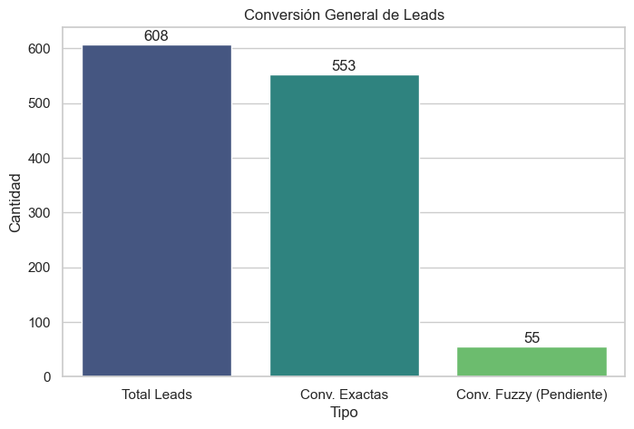
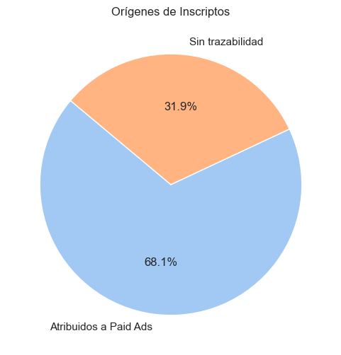
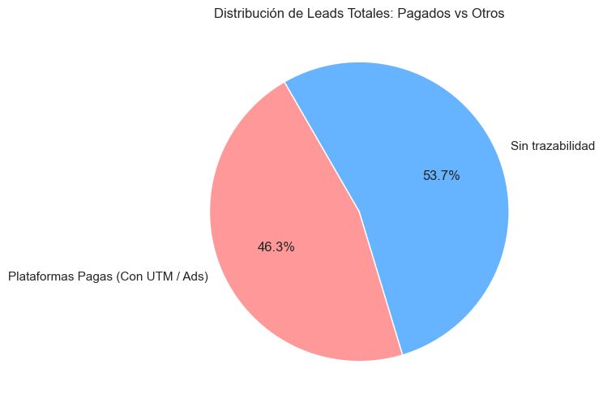
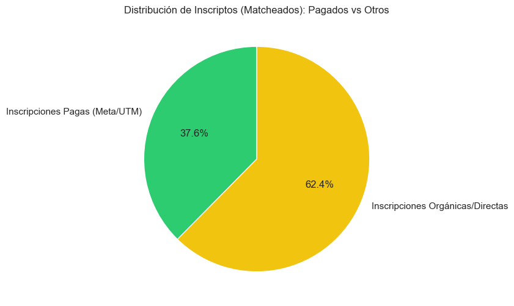

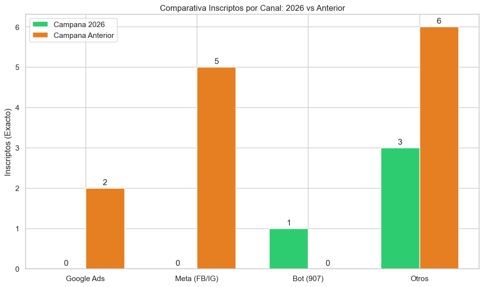

### Análisis de Tiempos de Resolución (Inscriptos Exactos)
Comparativa gráfica de cuánto demora en inscribirse un prospecto según su origen (filtrado de 0 a 180 días).

| Origen_Agrupado    |   Promedio |   Mediana |   Moda |
|:-------------------|-----------:|----------:|-------:|
| Orgánicos/Directos |       88.1 |        88 |      5 |
| Pagados (Meta/UTM) |       90.2 |        90 |     53 |

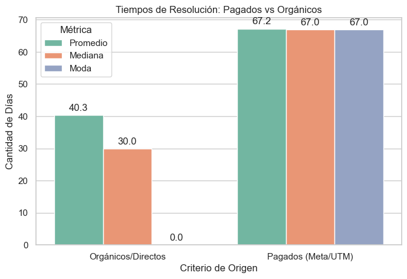
### Volumen de Consultas por Día y Mes
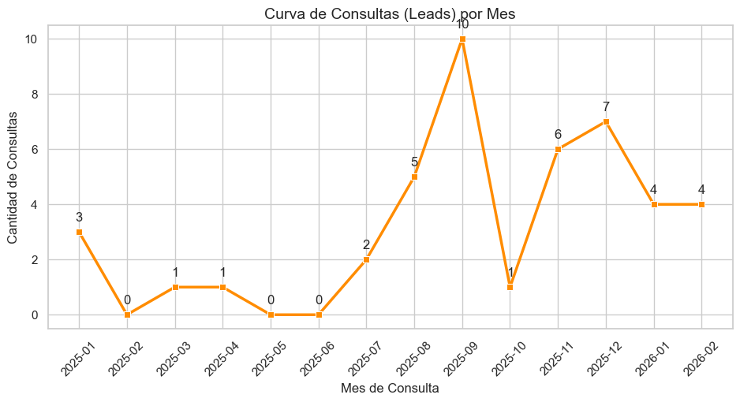

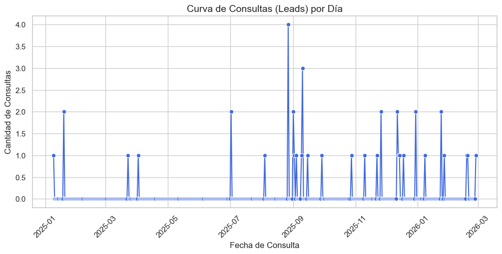

### Analisis Multi-Touch de Inscriptos
Cada inscripto puede haber consultado por multiples canales antes de inscribirse.

| Metrica | Total | 2026 | Campana Anterior |
|---|---|---|---|
| Inscriptos con 1 sola consulta | 9 (52.9%) | 3 (75.0%) | 6 (46.2%) |
| Promedio consultas por inscripto | 2.1 | 1.2 | 2.4 |
| Inscriptos con 1 canal | 15 (88.2%) | 4 (100.0%) | 11 (84.6%) |
| Inscriptos con 2+ canales | 2 (11.8%) | 0 (0.0%) | 2 (15.4%) |
| **Total inscriptos** | **17** | **4** | **13** |

#### Top Combinaciones (Total)
| Combinacion   |   Inscriptos |
|:--------------|-------------:|
| Otros         |            8 |
| Meta          |            5 |
| Google        |            1 |
| Meta + Otros  |            1 |
| Bot           |            1 |
| Google + Meta |            1 |

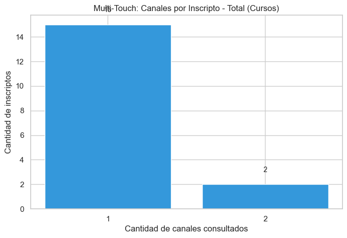
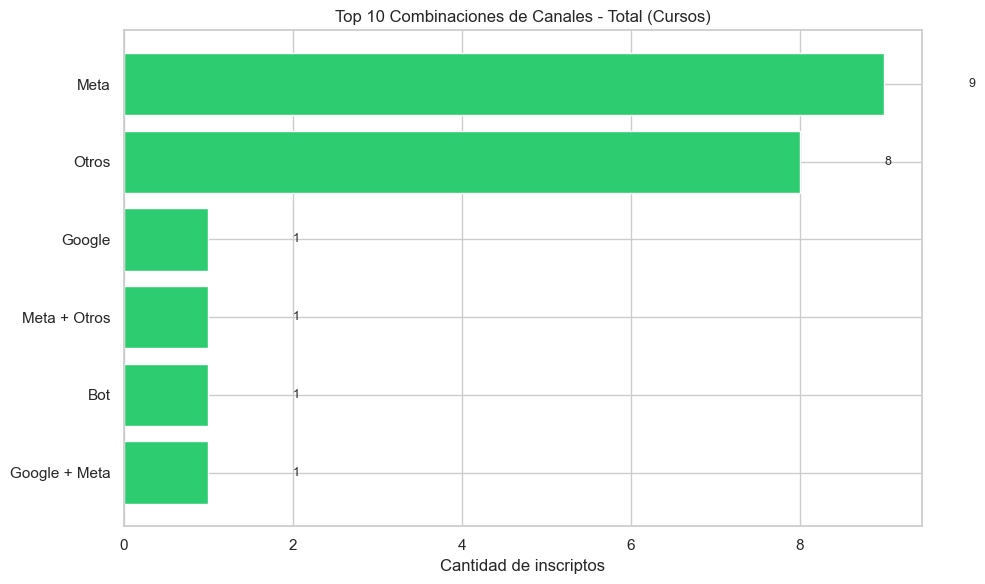
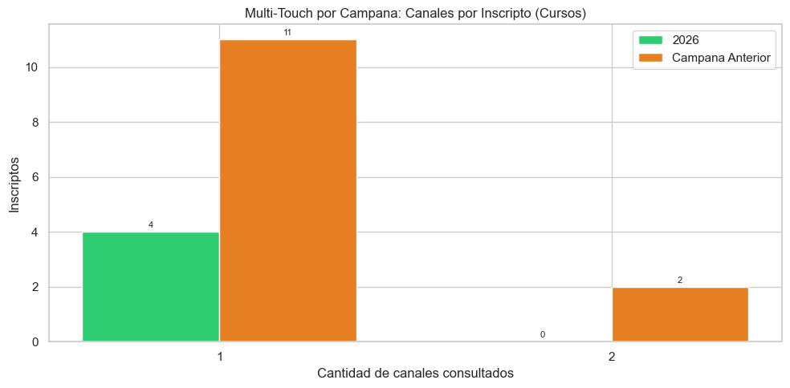

### Analisis Any-Touch: Participacion por Canal
Para cada inscripto se verifica si tuvo **al menos 1 contacto** con cada canal.
Un inscripto puede aparecer en varios canales a la vez (la suma supera 100%).

| Canal | Total | 2026 | Campana Anterior |
|---|---|---|---|
| **Bot** | 1 (5.9%) | 1 (25.0%) | 0 (0.0%) |
| **Google Ads** | 2 (11.8%) | 0 (0.0%) | 2 (15.4%) |
| **Meta (FB/IG)** | 7 (41.2%) | 0 (0.0%) | 7 (53.8%) |
| **Otros** | 9 (52.9%) | 3 (75.0%) | 6 (46.2%) |

#### Desglose por Tipo de Match (mejor match por persona, prioridad DNI > Email > Tel > Cel)
| Tipo Match | Total | 2026 | Campana Anterior |
|---|---|---|---|
| **Exacto (DNI)** | 9 (52.9%) | 2 (50.0%) | 7 (53.8%) |
| **Exacto (Email)** | 4 (23.5%) | 0 (0.0%) | 4 (30.8%) |
| **Exacto (Telefono)** | 2 (11.8%) | 2 (50.0%) | 0 (0.0%) |
| **Exacto (Celular)** | 2 (11.8%) | 0 (0.0%) | 2 (15.4%) |

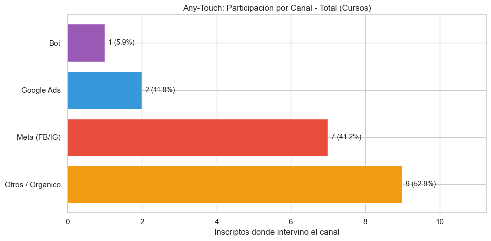
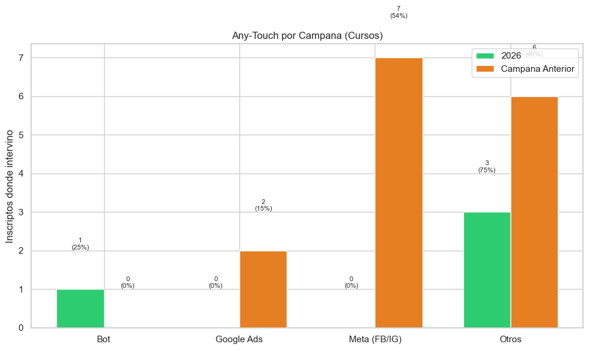

## 2. Journey del Estudiante (Comportamiento)
Analizando el número de veces que un usuario consulta antes de pagar su matrícula, observamos los siguientes patrones:

- **Promedio de Consultas por Persona:** 1.9 veces.
- **Tiempo de Decisión Promedio:** Un usuario tarda en promedio **115.9 días** desde su primera consulta hasta que formaliza el pago.

### Principales Fuentes que Inician el Recorrido (1er Touch) en Usuarios Inscriptos:
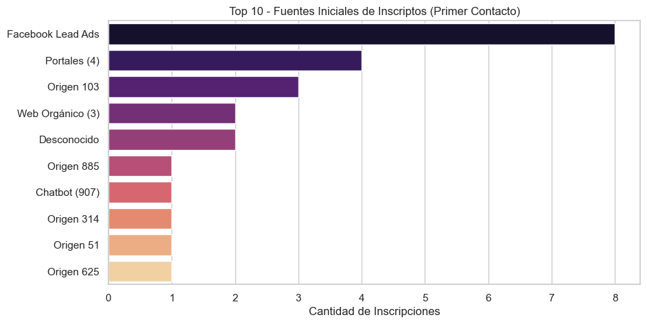
- **Facebook Lead Ads**: 4 inscriptos
- **Web Orgánico (3)**: 3 inscriptos
- **Portales (4)**: 2 inscriptos
- **Desconocido**: 2 inscriptos
- **Origen 41**: 1 inscriptos
- **Origen 130**: 1 inscriptos
- **Origen 103**: 1 inscriptos
- **Chatbot (907)**: 1 inscriptos
- **Origen 908**: 1 inscriptos
- **Origen 272**: 1 inscriptos

## 3. Curva de Inscripciones a lo largo del tiempo
La siguiente curva muestra el volumen de pagos confirmados por fecha, destacando los picos de inscripciones.

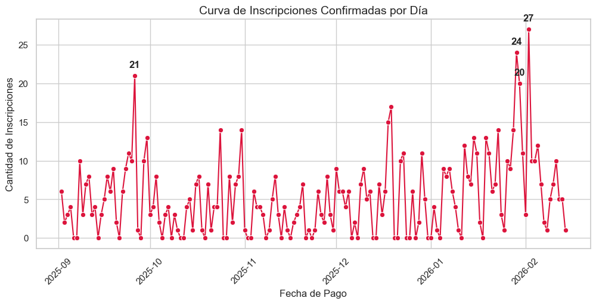

### Análisis de Picos de Inscripción
Los 4 días con mayor volumen de inscripciones confirmadas fueron:

| Fecha | Día de la Semana | Cantidad de Inscripciones |
|-------|------------------|---------------------------|
| 05/02/2026 | Jueves | 11 |
| 11/02/2026 | Miércoles | 10 |
| 04/02/2026 | Miércoles | 7 |
| 06/02/2026 | Viernes | 7 |

### Análisis de Valles de Inscripción (Días de menor actividad)
Analizando los días con las caídas más fuertes de inscripciones, podemos observar el patrón de comportamiento (mostrando los 15 días más bajos):

| Fecha | Día de la Semana | Cantidad de Inscripciones |
|-------|------------------|---------------------------|
| 06/12/2025 | Sábado | 0 |
| 07/12/2025 | Domingo | 0 |
| 08/12/2025 | Lunes | 0 |
| 09/12/2025 | Martes | 0 |
| 12/12/2025 | Viernes | 0 |
| 13/12/2025 | Sábado | 0 |
| 14/12/2025 | Domingo | 0 |
| 15/12/2025 | Lunes | 0 |
| 16/12/2025 | Martes | 0 |
| 17/12/2025 | Miércoles | 0 |
| 19/12/2025 | Viernes | 0 |
| 20/12/2025 | Sábado | 0 |
| 21/12/2025 | Domingo | 0 |
| 24/12/2025 | Miércoles | 0 |
| 25/12/2025 | Jueves | 0 |

**Observación sobre los valles:** El 40.0% de los días con menor volumen de inscripciones del histórico analizado coinciden directamente con fines de semana (Sábado/Domingo).

## Nota Metodologica
- **Cruce de datos:** Deduplicado por persona (DNI). Match exacto por DNI, Email, Telefono y Celular.
- **Modelo de este informe: Any-Touch ESTANDAR** - Un inscripto se cuenta en CADA canal por el que consulto (la suma supera 100%). Incluye todas las consultas, sin filtro de fecha vs pago.
- **Modelo Causal (informe separado):** Solo cuenta consultas cuya fecha es ANTERIOR O IGUAL a la fecha de pago (Consulta <= Insc_Fecha Pago). Consultas post-pago excluidas. Ver `Presupuesto_ROI_Causal`.
- **Tasas de conversion:** Se presentan dos tasas complementarias: (1) **sobre consultas** = inscriptos / consultas en ventana, mide eficiencia por interaccion; (2) **sobre personas** = inscriptos / personas unicas en ventana, mide eficiencia por individuo (KPI principal). Embudo: Consultas -> Personas -> Inscriptos. Ventana: leads del ano calendario.
- **Fuente:** Consultas exportadas de Salesforce, inscriptos del sistema academico.

## Conclusiones y Recomendaciones

1. **Atribución de Marketing:** Se logró trazar el origen de un alto porcentaje de inscriptos, lo que demuestra que los esfuerzos de captación inicial en Salesforce tienen un impacto directo comprobable.
2. **Tiempo de Maduración:** Dado que el tiempo promedio de decisión supera el contacto inicial, las estrategias de "Remarketing" o "Nutrición de Leads" por email/teléfono durante estas semanas intermedias son vitales.
3. **Calidad de Datos:** Una porción de los registros se inscribió de manera directa o ingresó usando correos/teléfonos muy distintos. Se recomienda continuar fortaleciendo la trazabilidad mediante canales digitales.

## Atribucion Causal (consulta <= fecha de pago)

*Ventana: 01/01/2026 - 14/02/2026 | desde Ene 2026 (ano calendario)*

Consultas post-pago excluidas: 0

| Canal | Inscriptos (Any-Touch Causal) | % Participacion |
|-------|---:|---:|
| Google | 0 | 0.0% |
| Facebook | 0 | 0.0% |
| Bot | 0 | 0.0% |
| Otros | 2 | 100.0% |
| **Total Unico** | **2** | **100%** |

Multi-canal: 1 canal=2, 2 canales=0, 3+=0

Inscriptos sin lead/match: 9 de 11 (81.8%)

*Nota: El modelo causal solo cuenta consultas cuya fecha es ANTERIOR O IGUAL a la fecha de pago. Consultas post-pago (soporte, seguimiento) excluidas.*

