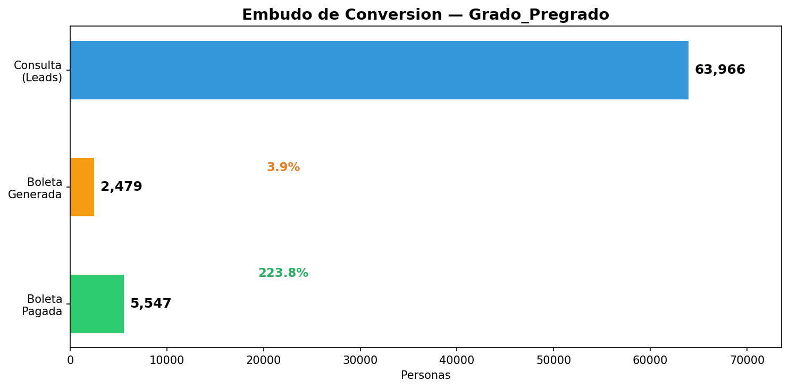
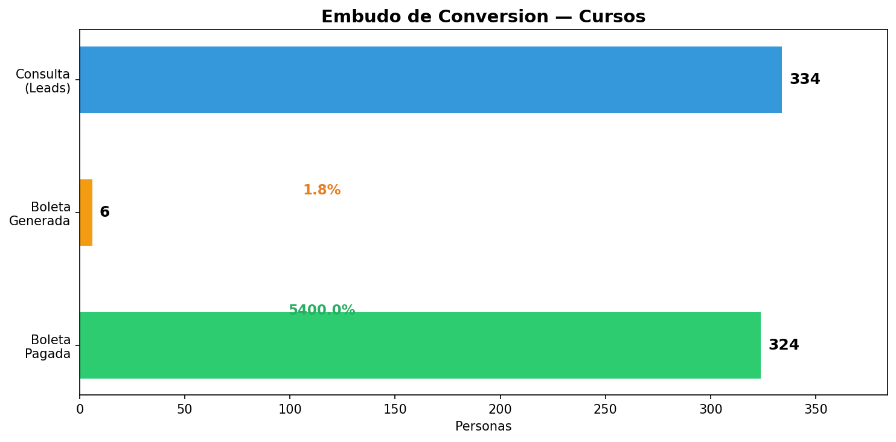
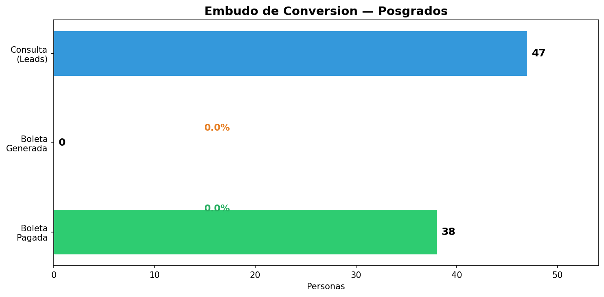
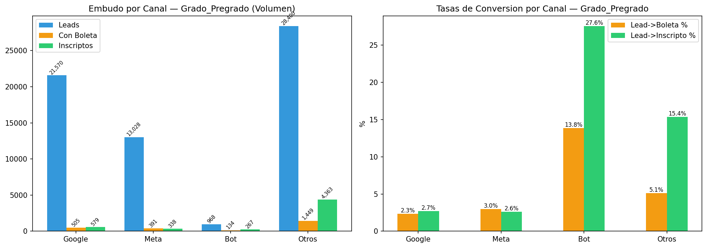
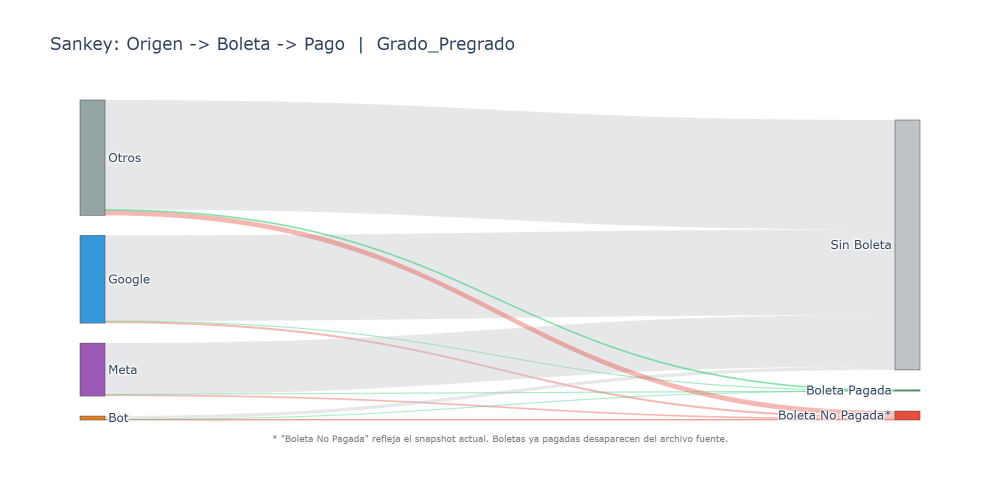
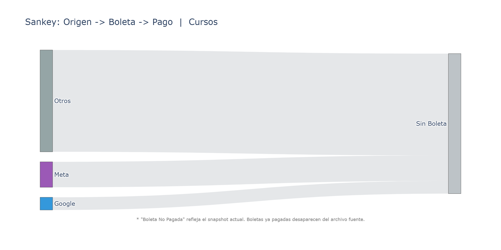
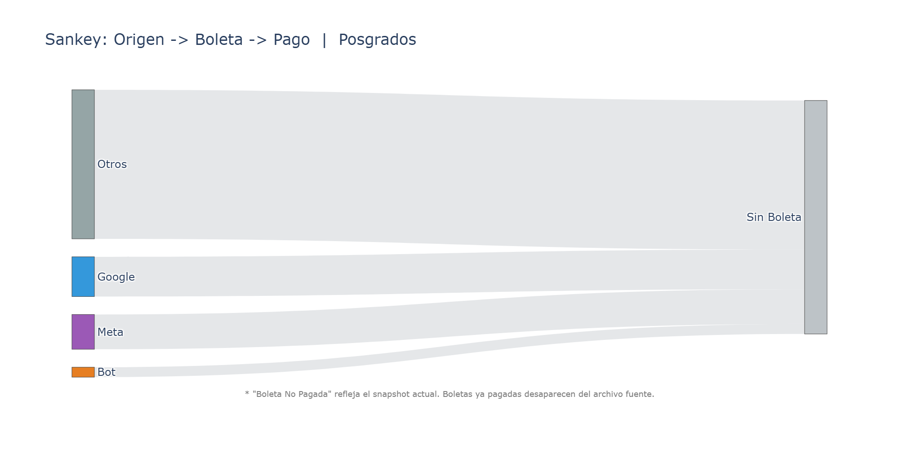

# Embudo de Conversion: Consulta -> Boleta -> Inscripción

Fecha: 2026-03-12

## Resumen por Segmento

### Grado_Pregrado

| Etapa | Personas | Tasa desde anterior |
|---|---:|---:|
| Consulta (leads con DNI) | 63,055 | - |
| Generó Boleta | 2,404 | 3.8% |
| Pagó (inscripto) | 5,154 | 8.2% |

**Boleta -> Pago (todas las boletas):** 297 / 7,704 = 3.9%

**Boletas sin lead asociado:** 5,300  |  **Inscriptos sin lead:** 3,665

### Cursos

| Etapa | Personas | Tasa desde anterior |
|---|---:|---:|
| Consulta (leads con DNI) | 419 | - |
| Generó Boleta | 7 | 1.7% |
| Pagó (inscripto) | 415 | 99.0% |

**Boleta -> Pago (todas las boletas):** 5 / 374 = 1.3%

**Boletas sin lead asociado:** 367  |  **Inscriptos sin lead:** 465

### Posgrados

| Etapa | Personas | Tasa desde anterior |
|---|---:|---:|
| Consulta (leads con DNI) | 47 | - |
| Generó Boleta | 0 | 0.0% |
| Pagó (inscripto) | 38 | 80.9% |

**Boleta -> Pago (todas las boletas):** 0 / 136 = 0.0%

**Boletas sin lead asociado:** 136  |  **Inscriptos sin lead:** 301

## Desglose por Canal

| Segmento | Canal | Leads | Con Boleta | Tasa L->B | Inscriptos | Tasa L->I | Tasa B->I |
|---|---|---:|---:|---:|---:|---:|---:|
| Grado_Pregrado | Google | 21,597 | 497 | 2.3% | 577 | 2.7% | 116.1% |
| Grado_Pregrado | Meta | 12,565 | 380 | 3.0% | 291 | 2.3% | 76.6% |
| Grado_Pregrado | Bot | 932 | 129 | 13.8% | 249 | 26.7% | 193.0% |
| Grado_Pregrado | Otros | 27,961 | 1,398 | 5.0% | 4,037 | 14.4% | 288.8% |
| Cursos | Google | 14 | 0 | 0.0% | 13 | 92.9% | 0.0% |
| Cursos | Meta | 50 | 1 | 2.0% | 50 | 100.0% | 5000.0% |
| Cursos | Bot | 16 | 1 | 6.2% | 15 | 93.8% | 1500.0% |
| Cursos | Otros | 339 | 5 | 1.5% | 337 | 99.4% | 6740.0% |
| Posgrados | Google | 8 | 0 | 0.0% | 6 | 75.0% | 0.0% |
| Posgrados | Meta | 7 | 0 | 0.0% | 3 | 42.9% | 0.0% |
| Posgrados | Bot | 2 | 0 | 0.0% | 2 | 100.0% | 0.0% |
| Posgrados | Otros | 30 | 0 | 0.0% | 27 | 90.0% | 0.0% |

## Desglose por Campana

| Segmento | Campana | Leads | Con Boleta | Tasa L->B | Inscriptos | Tasa L->I |
|---|---|---:|---:|---:|---:|---:|
| Grado_Pregrado | Ingreso 2026 | 22,260 | 2,001 | 9.0% | 4,352 | 19.6% |
| Grado_Pregrado | Campaña Anterior | 40,795 | 403 | 1.0% | 802 | 2.0% |
| Cursos | 2026 | 113 | 2 | 1.8% | 111 | 98.2% |
| Cursos | Campaña Anterior | 306 | 5 | 1.6% | 304 | 99.3% |
| Posgrados | 2026 | 20 | 0 | 0.0% | 17 | 85.0% |
| Posgrados | Campaña Anterior | 27 | 0 | 0.0% | 21 | 77.8% |

## Sankey: Origen -> Boleta -> Pago

### Grado_Pregrado

> *"Boleta No Pagada" refleja el snapshot actual del archivo. Boletas ya pagadas
> desaparecen del archivo fuente, por lo que la cifra real de boletas generadas es mayor.*

### Cursos

> *"Boleta No Pagada" refleja el snapshot actual del archivo. Boletas ya pagadas
> desaparecen del archivo fuente, por lo que la cifra real de boletas generadas es mayor.*

### Posgrados

> *"Boleta No Pagada" refleja el snapshot actual del archivo. Boletas ya pagadas
> desaparecen del archivo fuente, por lo que la cifra real de boletas generadas es mayor.*

## Nota Metodológica

- **Modelo de atribución:** Embudo por persona (DNI). Deduplicado por DNI limpio.
- **Persona** = DNI limpio único. Leads sin DNI no se incluyen en el embudo.
- **Consulta**: persona que generó al menos 1 lead/consulta en Salesforce.
- **Boleta**: persona cuyo DNI aparece en el archivo de boletas generadas.
- **Inscripto**: persona cuyo lead matcheó exactamente con un inscripto (pagó matrícula). Match Exacto: DNI > Email > Teléfono > Celular (prioridad).
- La tasa Lead->Boleta puede subestimarse si la persona usó datos diferentes en Salesforce vs sistema de boletas.
- La tasa Boleta->Pago se calcula sobre TODAS las boletas del segmento (no solo las conectadas a leads).
- **Any-Touch:** Para atribución multi-canal (inscriptos que consultaron por más de un canal), referirse al Informe Analítico (04_reporte_final).
- **Ventana:** Grado/Pregrado desde 01/09/2025, Cursos y Posgrados desde 01/01/2026.