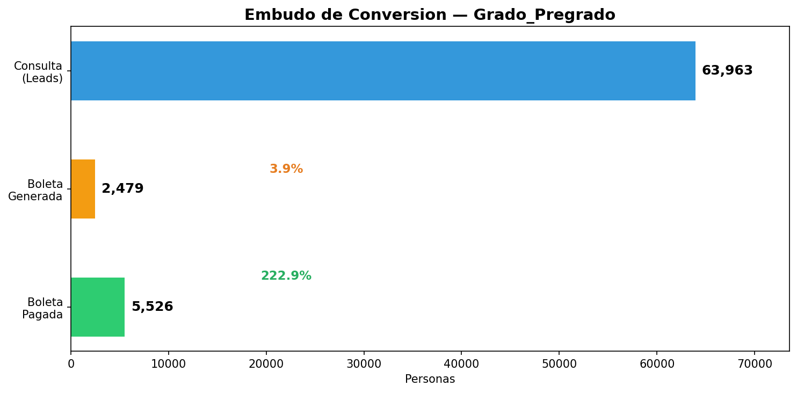
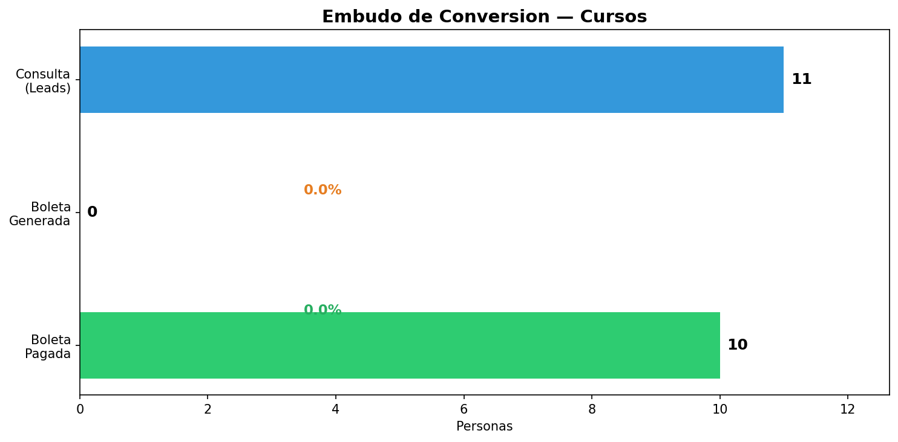
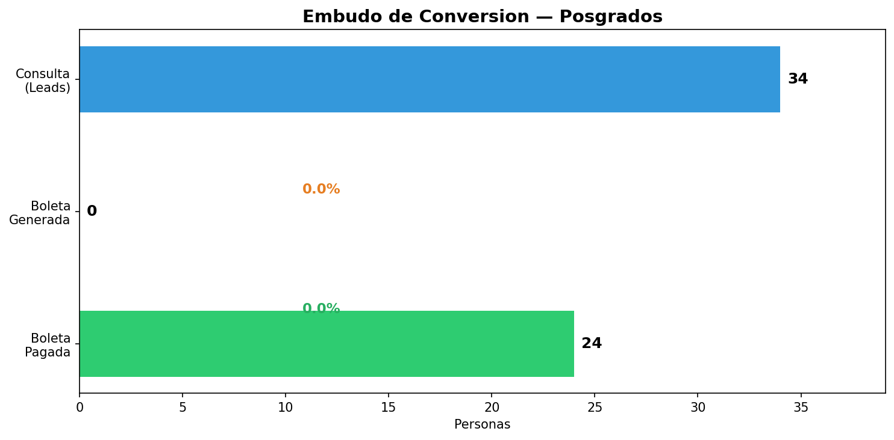
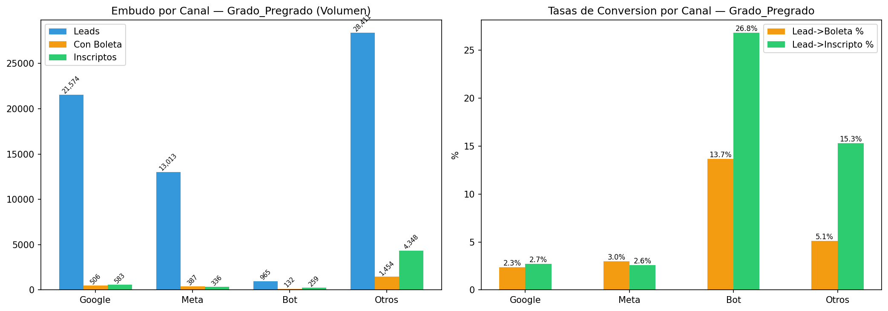
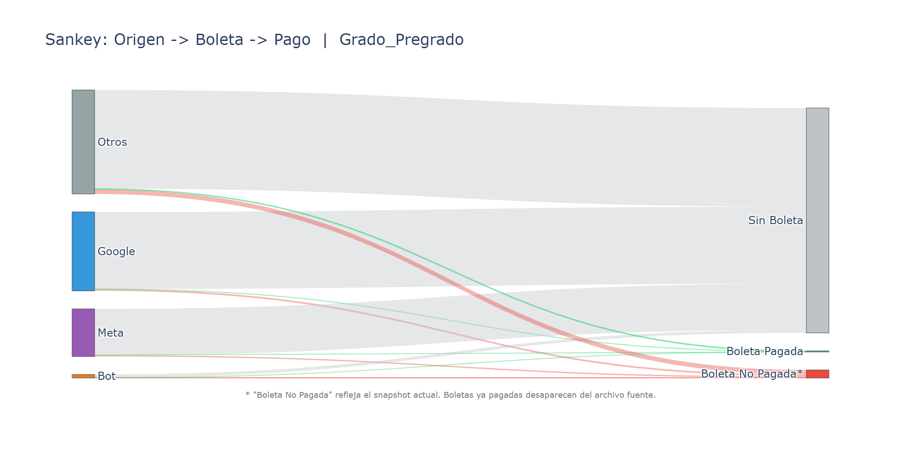
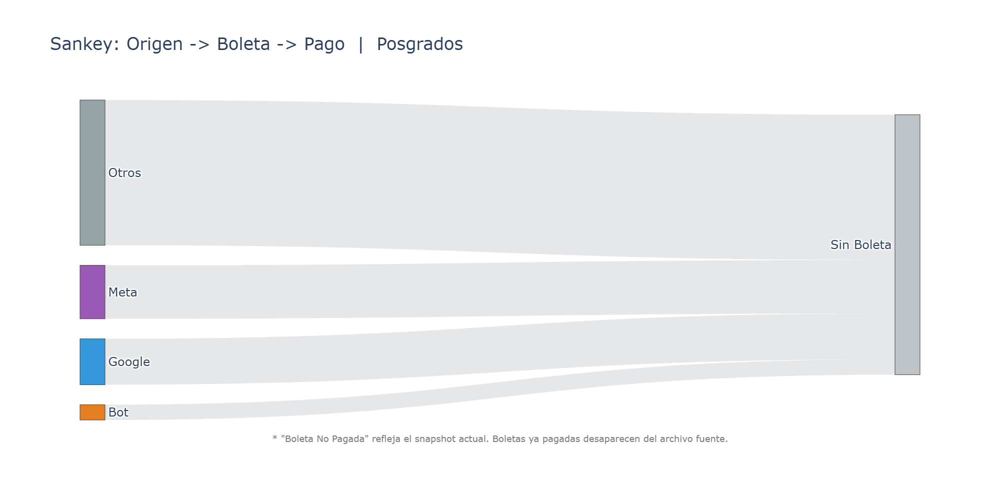
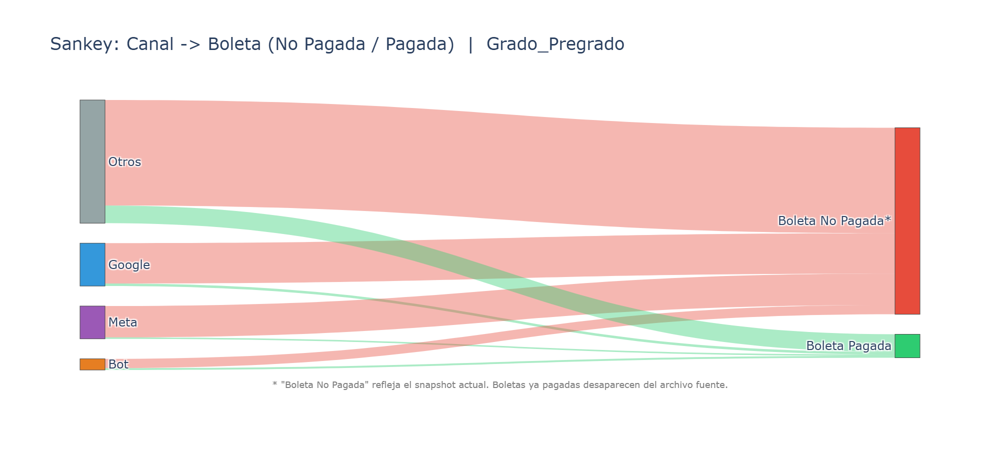

# Embudo de Conversion: Consulta -> Boleta -> Inscripción

Fecha: 2026-03-14

## Resumen por Segmento

### Grado_Pregrado

| Etapa | Personas | Tasa desde anterior |
|---|---:|---:|
| Consulta (leads con DNI) | 63,963 | - |
| Generó Boleta | 2,479 | 3.9% |
| Pagó (inscripto) | 5,526 | 8.6% |

**Boleta -> Pago (todas las boletas):** 444 / 7,704 = 5.8%

**Boletas sin lead asociado:** 5,225  |  **Inscriptos sin lead:** 4,042

### Cursos

| Etapa | Personas | Tasa desde anterior |
|---|---:|---:|
| Consulta (leads con DNI) | 11 | - |
| Generó Boleta | 0 | 0.0% |
| Pagó (inscripto) | 10 | 90.9% |

**Boleta -> Pago (todas las boletas):** 0 / 374 = 0.0%

**Boletas sin lead asociado:** 374  |  **Inscriptos sin lead:** 84

### Posgrados

| Etapa | Personas | Tasa desde anterior |
|---|---:|---:|
| Consulta (leads con DNI) | 34 | - |
| Generó Boleta | 0 | 0.0% |
| Pagó (inscripto) | 24 | 70.6% |

**Boleta -> Pago (todas las boletas):** 0 / 136 = 0.0%

**Boletas sin lead asociado:** 136  |  **Inscriptos sin lead:** 301

## Desglose por Canal

| Segmento | Canal | Leads | Con Boleta | Tasa L->B | Inscriptos | Tasa L->I | Tasa B->I |
|---|---|---:|---:|---:|---:|---:|---:|
| Grado_Pregrado | Google | 21,574 | 506 | 2.3% | 583 | 2.7% | 115.2% |
| Grado_Pregrado | Meta | 13,013 | 387 | 3.0% | 336 | 2.6% | 86.8% |
| Grado_Pregrado | Bot | 965 | 132 | 13.7% | 259 | 26.8% | 196.2% |
| Grado_Pregrado | Otros | 28,411 | 1,454 | 5.1% | 4,348 | 15.3% | 299.0% |
| Cursos | Google | 1 | 0 | 0.0% | 1 | 100.0% | 0.0% |
| Cursos | Meta | 2 | 0 | 0.0% | 2 | 100.0% | 0.0% |
| Cursos | Bot | 0 | 0 | 0.0% | 0 | 0.0% | 0.0% |
| Cursos | Otros | 8 | 0 | 0.0% | 7 | 87.5% | 0.0% |
| Posgrados | Google | 6 | 0 | 0.0% | 4 | 66.7% | 0.0% |
| Posgrados | Meta | 7 | 0 | 0.0% | 3 | 42.9% | 0.0% |
| Posgrados | Bot | 2 | 0 | 0.0% | 2 | 100.0% | 0.0% |
| Posgrados | Otros | 19 | 0 | 0.0% | 15 | 78.9% | 0.0% |

## Desglose por Campana

| Segmento | Campana | Leads | Con Boleta | Tasa L->B | Inscriptos | Tasa L->I |
|---|---|---:|---:|---:|---:|---:|
| Grado_Pregrado | Ingreso 2026 | 22,995 | 2,068 | 9.0% | 4,680 | 20.4% |
| Grado_Pregrado | Campaña Anterior | 40,968 | 411 | 1.0% | 846 | 2.1% |
| Cursos | 2026 | 3 | 0 | 0.0% | 3 | 100.0% |
| Cursos | Campaña Anterior | 8 | 0 | 0.0% | 7 | 87.5% |
| Posgrados | 2026 | 7 | 0 | 0.0% | 4 | 57.1% |
| Posgrados | Campaña Anterior | 27 | 0 | 0.0% | 20 | 74.1% |

## Sankey: Origen -> Boleta -> Pago

### Grado_Pregrado

> *"Boleta No Pagada" refleja el snapshot actual del archivo. Boletas ya pagadas
> desaparecen del archivo fuente, por lo que la cifra real de boletas generadas es mayor.*

### Cursos

> *"Boleta No Pagada" refleja el snapshot actual del archivo. Boletas ya pagadas
> desaparecen del archivo fuente, por lo que la cifra real de boletas generadas es mayor.*

### Posgrados

> *"Boleta No Pagada" refleja el snapshot actual del archivo. Boletas ya pagadas
> desaparecen del archivo fuente, por lo que la cifra real de boletas generadas es mayor.*

## Sankey: Canal -> Boleta (Solo Generadas)

### Grado_Pregrado

> Este diagrama muestra solo las personas que generaron boleta,
> separando entre las que pagaron y las que no.

## Nota Metodológica

- **Modelo de atribución:** Embudo por persona (DNI). Deduplicado por DNI limpio.
- **Persona** = DNI limpio único. Leads sin DNI no se incluyen en el embudo.
- **Consulta**: persona que generó al menos 1 lead/consulta en Salesforce.
- **Boleta**: persona cuyo DNI aparece en el archivo de boletas generadas.
- **Inscripto**: persona cuyo lead matcheó exactamente con un inscripto (pagó matrícula). Match Exacto: DNI > Email > Teléfono > Celular (prioridad).
  - Grado_Pregrado: DNI (5,333), Email (151), Teléfono (22), Celular (20). Total: 5,526.
  - Cursos: DNI (9), Email (0), Teléfono (1), Celular (0). Total: 10.
  - Posgrados: DNI (23), Email (0), Teléfono (1), Celular (0). Total: 24.
- La tasa Lead->Boleta puede subestimarse si la persona usó datos diferentes en Salesforce vs sistema de boletas.
- La tasa Boleta->Pago se calcula sobre TODAS las boletas del segmento (no solo las conectadas a leads).
- **Any-Touch:** Para atribución multi-canal (inscriptos que consultaron por más de un canal), referirse al Informe Analítico (04_reporte_final).
- **Ventana:** Grado/Pregrado desde 01/09/2025, Cursos y Posgrados desde 01/01/2026.