# Informe Analítico de Marketing y Trazabilidad

Este informe consolida el análisis generado a partir del cruce **exacto** de bases de datos de **Consultas (Leads en Salesforce)** e **Inscriptos** (cruzados por DNI, Email y Teléfono). Los registros encontrados por similitud de nombres (fuzzy) se presentan en un **informe complementario aparte**.

## 1. Resumen Ejecutivo

| Métrica | Valor |
|---------|-------|
| Total Leads Históricos (Sankey y Volumen) | 216,790 |
| Total Leads Analizados para Conversión | 216,790 |
| Leads Convertidos a Inscripto (exacto en muestra) | 6,945 |
| Tasa de Conversión (exacta) | 3.20% |
| Inscriptos Atribuidos a Paid Ads | 4,296 (61.3%) |
| Inscriptos sin trazabilidad (sin lead previo) | 2,714 |

### Conversión General

### Composición de Inscriptos

## 2. Análisis por Formulario de Origen

### Top 10 Formularios por Volumen
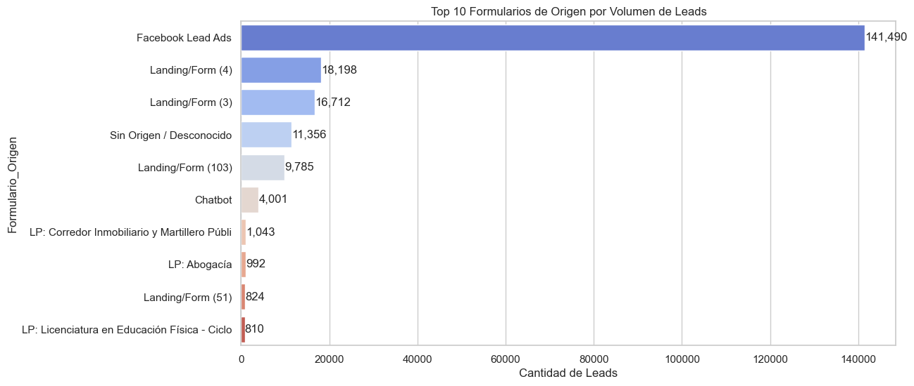

### Tasa de Conversión por Origen (mín. 100 leads)
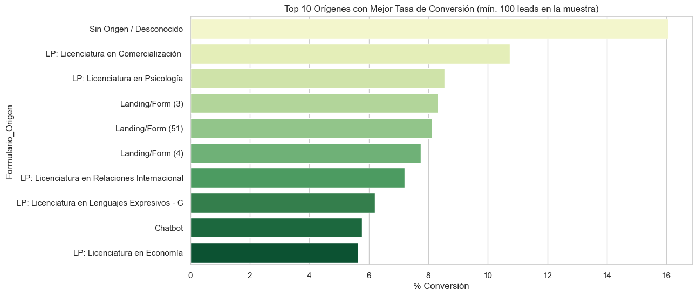

## 3. Análisis por Modalidad

### Distribución de Leads
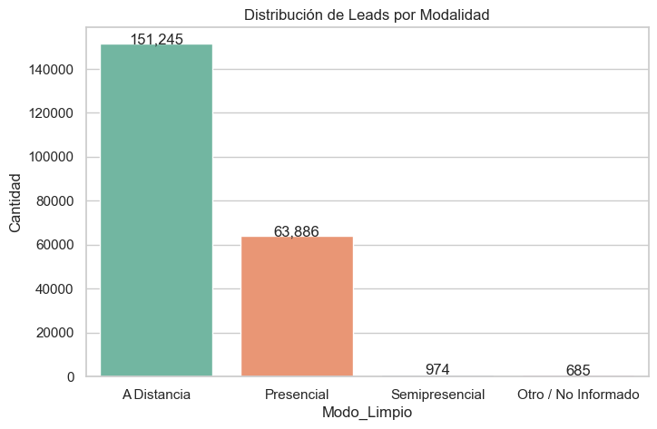

### Tasa de Conversión por Modalidad
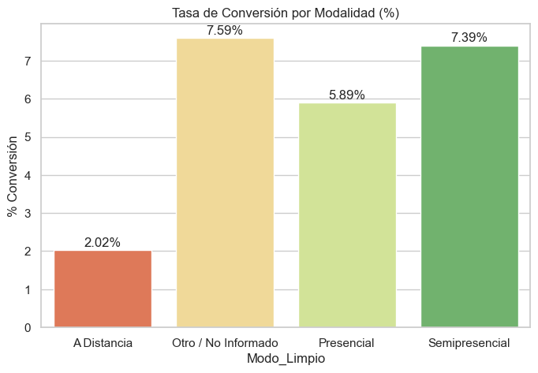

## 4. Flujo Visual (Sankey)
El siguiente diagrama muestra el flujo agrupado desde el Formulario de Origen, pasando por la Modalidad, hasta el estado final de inscripción:

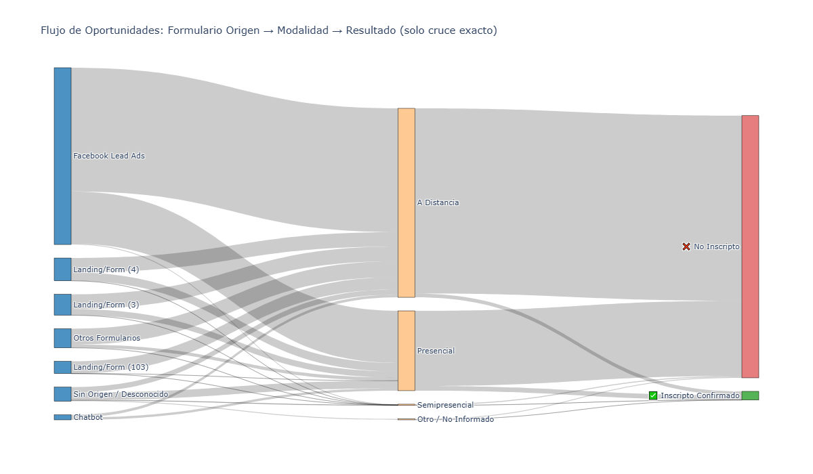

## 5. Reporte del Chatbot (Origen 907)

| Métrica | Bot (907) | General |
|---------|-----------|---------|
| Total Leads | 4,001 | 216,790 |
| Inscriptos Confirmados | 231 | 6,945 |
| Tasa de Conversión | 5.77% | 3.20% |

## 6. Conclusiones y Recomendaciones

1. **Atribución de Marketing:** Se logró trazar el origen exacto de un porcentaje significativo de inscriptos, demostrando el impacto directo de las campañas de captación.
2. **Chatbot:** El Bot (907) presenta una tasa de conversión superior a la media general (5.77% vs 3.20%), lo que valida su efectividad como canal de captación.
3. **Calidad de Datos:** 833 registros requirieron cruce fuzzy y están pendientes de verificación humana (ver informe complementario).

---
*Archivos complementarios:*
- `reporte_complementario_fuzzy.xlsx` - Coincidencias por similitud de nombres (requiere verificación)
- `reporte_inscriptos_bot_907.xlsx` - Detalle específico del Bot
- `diagrama_sankey_agrupado.pdf` - Diagrama Sankey en alta resolución

---

## Tasa de Conversión Deduplicada (por persona única)

Para evitar contar el mismo Lead más de una vez (una persona puede generar múltiples consultas), se deduplicó por DNI/Email:

| Métrica | Valor |
|---------|-------|
| Personas únicas | 174,762 |
| Personas convertidas (exacto) | 4,417 |
| **Tasa de conversión real** | **2.53%** |

## Sankey: Inscriptos Exactos (Origen -> Modalidad)
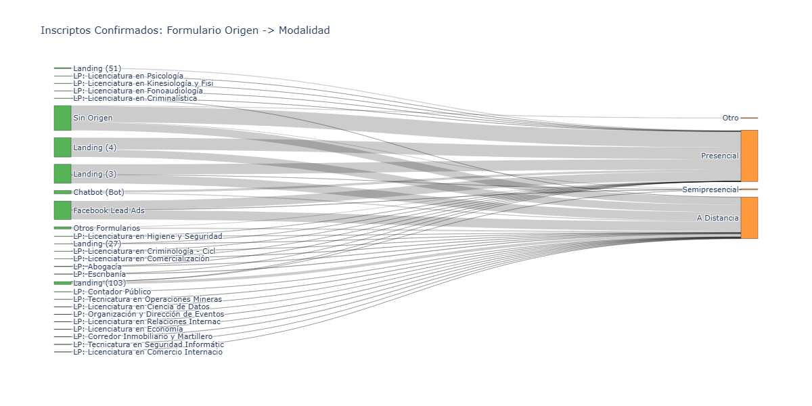

## Sankey: Consultas hasta Inscripción
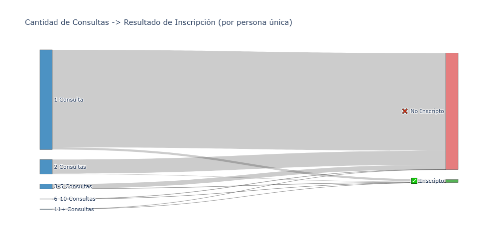

## Sankey: Personas del Bot — Otros orígenes consultados
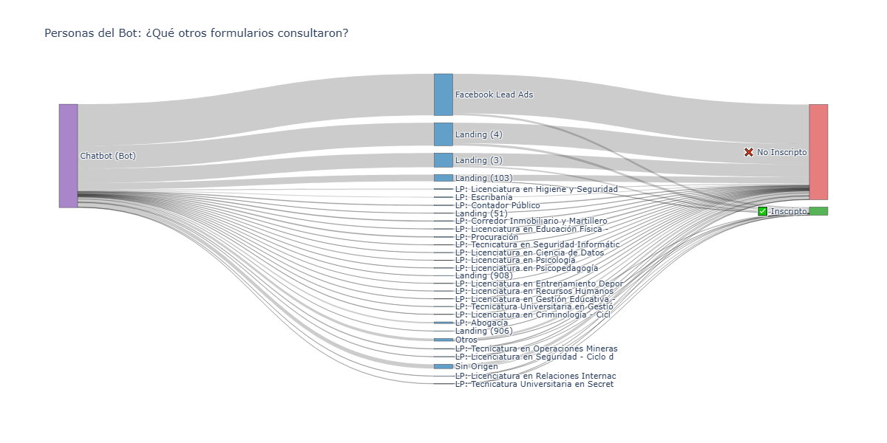

## Análisis UTM
Ver reporte completo en `informe_utm.md`.

### UTM Source (Top 10)
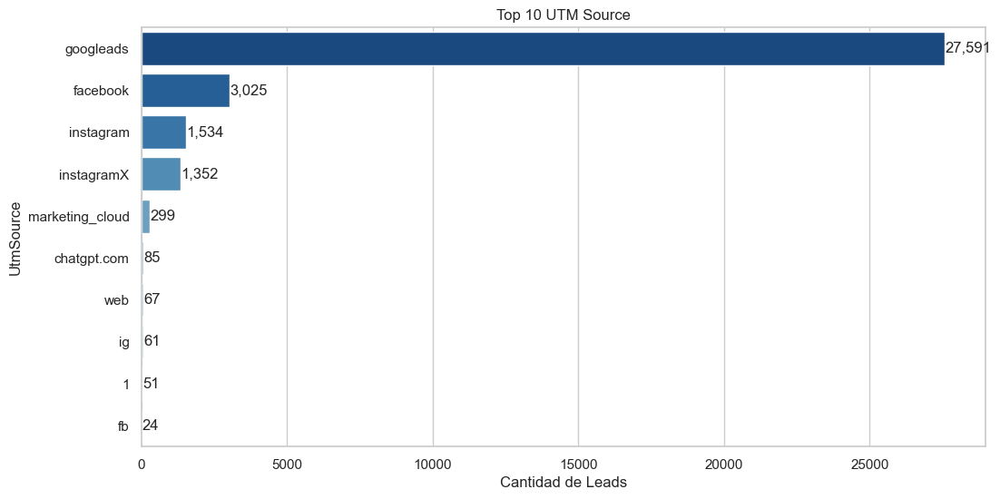

### UTM Campaign (Top 15)
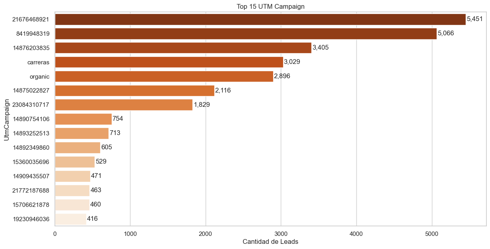

### Conversión por UTM Source
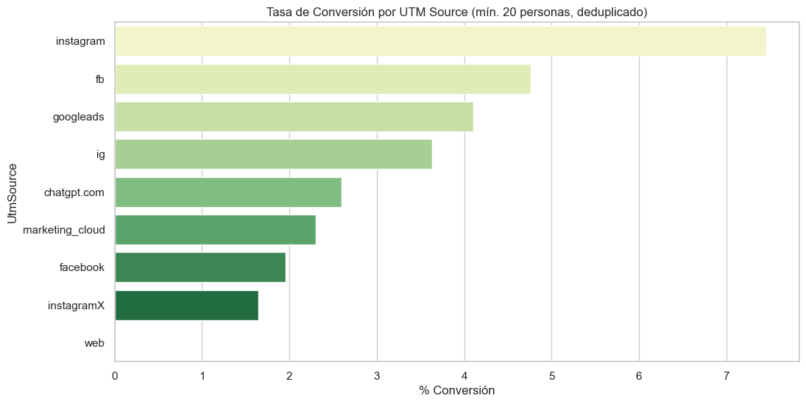
