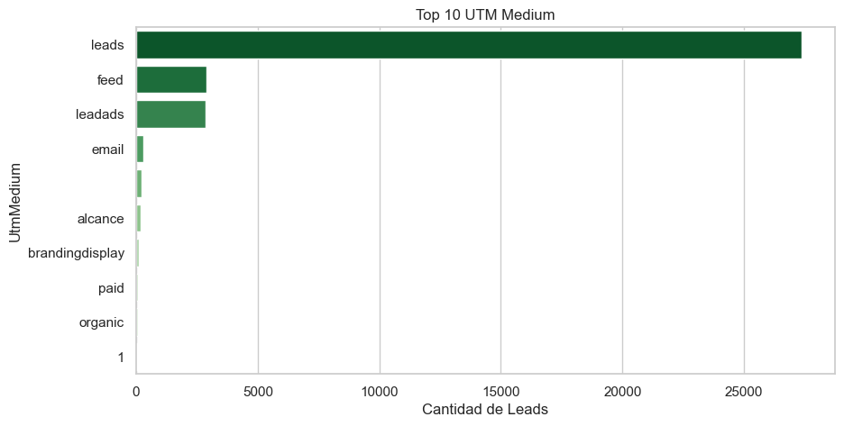

# Reporte de UTMs

## Cobertura
| Métrica | Valor |
|---------|-------|
| Leads con UTM | 34,141 (15.7%) |
| Leads sin UTM | 182,649 (84.3%) |

## Top 10 UTM Source

## Top 15 UTM Campaign

## Top 10 UTM Medium

## Tasa de Conversión por UTM Source (deduplicado por persona)

