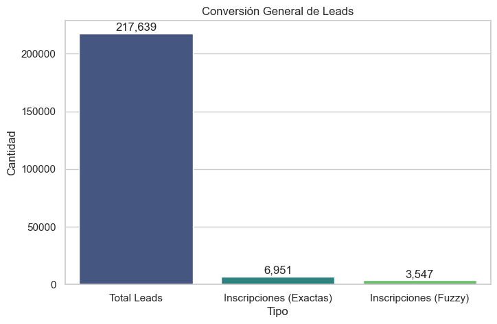
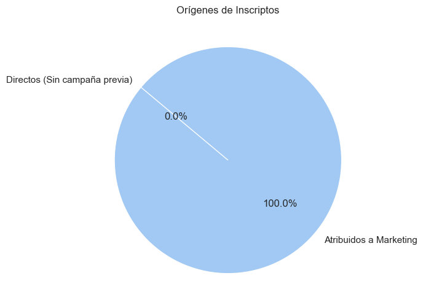
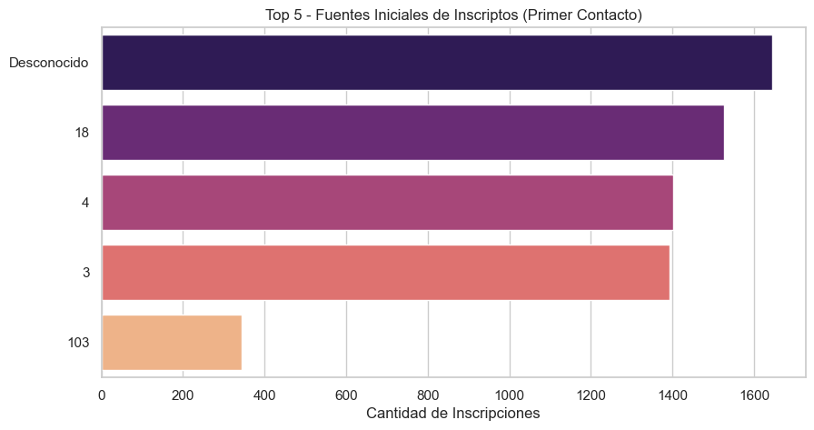

# Informe Analítico de Marketing y Trazabilidad

Este informe consolida el análisis generado a partir del cruce de bases de datos de **Consultas (Leads en Salesforce)** e **Inscriptos**, unificando los orígenes y calculando el "Journey" de las personas. Durante la lectura de las bases de datos originales se aplicaron procesos de **deduplicación** para garantizar que los solapamientos de archivos no duplicaran los registros.

## 1. Resumen Ejecutivo
Se analizaron un total de **217,639** leads únicos y **10,498** inscriptos únicos para identificar qué campañas e interacciones previas generaron las inscripciones finales.

| Métrica | Valor |
|---------|-------|
| Total Leads | 217,639 |
| Total Inscriptos | 10,498 |
| Inscriptos Atribuidos a un Lead | 10,498 (100.0% del total) |
| Inscriptos Directos (Sin Lead Previo) | 0 |
| Tasa de Conversión de Leads | 4.82% |

*(Nota: De los leads atribuidos, 3,547 fueron encontrados mediante algoritmos de inteligencia de similitud de nombres y requieren verificación humana en el Excel).*

### Visualización de Tasas y Atribución

## 2. Journey del Estudiante (Comportamiento)
Analizando el número de veces que un usuario consulta antes de pagar su matrícula, observamos los siguientes patrones:

- **Promedio de Consultas por Persona:** 1.2 veces.
- **Tiempo de Decisión Promedio:** Un usuario tarda en promedio **191.5 días** desde su primera consulta hasta que formaliza el pago.

### Principales Fuentes que Inician el Recorrido (1er Touch) en Usuarios Inscriptos:

- **Desconocido**: 1644 inscriptos
- **18**: 1526 inscriptos
- **4**: 1401 inscriptos
- **3**: 1392 inscriptos
- **103**: 345 inscriptos

## 3. Conclusiones y Recomendaciones

1. **Atribución de Marketing:** Se logró trazar el origen de un alto porcentaje de inscriptos, lo que demuestra que los esfuerzos de captación inicial en Salesforce tienen un impacto directo comprobable.
2. **Tiempo de Maduración:** Dado que el tiempo promedio de decisión supera el contacto inicial, las estrategias de "Remarketing" o "Nutrición de Leads" por email/teléfono durante estas semanas intermedias son vitales.
3. **Calidad de Datos:** Una porción de los registros se inscribió de manera directa o ingresó usando correos/teléfonos muy distintos. Se recomienda continuar fortaleciendo la trazabilidad mediante canales digitales.

