# Informe Analítico de Marketing y Trazabilidad

**Aviso: Este documento es un BORRADOR. Todos los datos contenidos aquí están pendientes de verificación.**

*(Datos actualizados al 14 de febrero de 2026)*

Este informe consolida el análisis generado a partir del cruce de bases de datos de **Consultas (Leads en Salesforce)** e **Inscriptos**, unificando los orígenes y calculando el "Journey" de las personas. Durante la lectura de las bases de datos originales se aplicaron procesos de **deduplicación** para garantizar que los solapamientos de archivos no duplicaran los registros.

## 1. Resumen Ejecutivo
Se analizaron un total de **159** leads únicos y **325** inscriptos únicos para identificar qué campañas e interacciones previas generaron las inscripciones finales.

| Métrica | Valor |
|---------|-------|
| Total Leads | 159 |
| Total Inscriptos | 325 |
| Inscriptos Atribuidos a un Lead (Exacto) | 52 (16.0% del total) |
| Inscriptos sin trazabilidad | 237 |
| **Tasa de Conversión General Leads (Exacta)** | **77.78%** |

### Desglose por Ecosistema Principal
*(Nota: Las tasas de conversión reflejan estrictamente cruces exactos sin contemplar coincidencias difusas)*

| Ecosistema | Total Leads Analizados | Inscriptos Atribuidos | Tasa de Conversión |
|------------|------------------------|-----------------------|--------------------|
| **Google Ads** | 21 | 12 | **57.14%** |
| **Meta (FB/IG)** | 75 | 57 | **76.00%** |

### Procedencia de Leads (Pagado vs Orgánico/Desconocido)
De los 159 leads capturados, se analizó cuántos poseen parámetros tracking (UTM) o provienen directamente de formularios dentro de redes (ej. Facebook Lead Ads), frente a los que no tienen este tracking:
- **Plataformas Pagadas Confirmadas:** 102 leads (64.2%)
- **Otros (Orgánico / Sin Tracking ID):** 57 leads (35.8%)

De igual manera, al observar solo las **123 inscripciones (cruces exactos)** logradas a partir de leads, la distribución de origen es:
- **Inscripciones Pagadas (Meta/UTM):** 72 (58.5%)
- **Inscripciones Orgánicas/Directas:** 51 (41.5%)

*(Nota sobre Fuzzys: Existen 36 leads sospechosos de ser inscriptos (36 inscriptos) que fueron encontrados mediante algoritmos de similitud de nombres y requieren verificación manual. NO han sido incluidos en ninguna tasa de conversión).*

### Atribución por Campaña
La columna `Campana_Lead` identifica si el lead que generó la inscripción pertenece a la campaña actual o a una anterior.
| Campaña | Inscriptos Exactos |
|---|---|
| Campaña actual (2026) | 33 |
| Campaña anterior (match histórico) | 90 |

### Visualización de Tasas y Atribución
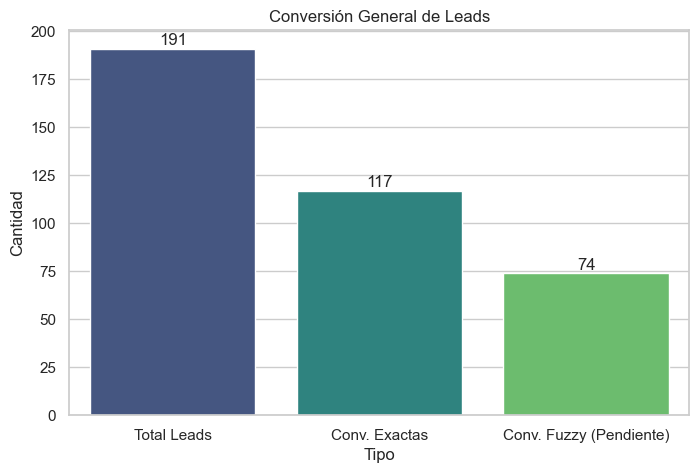
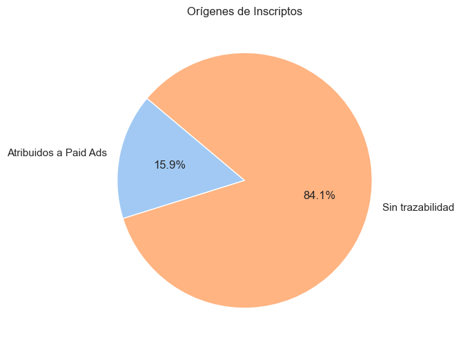
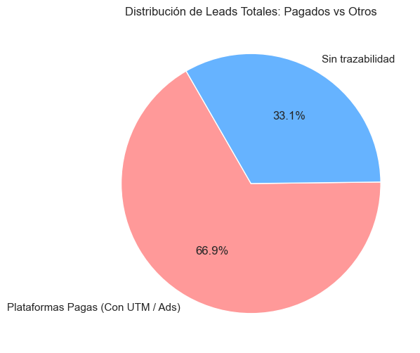
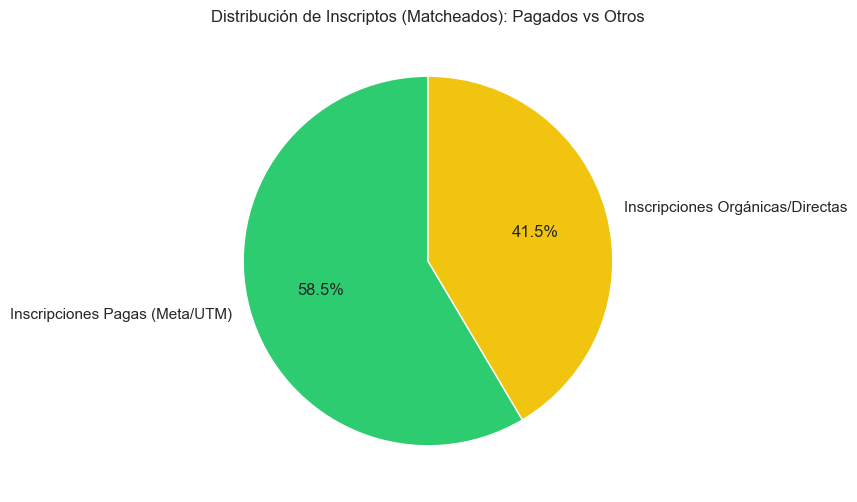

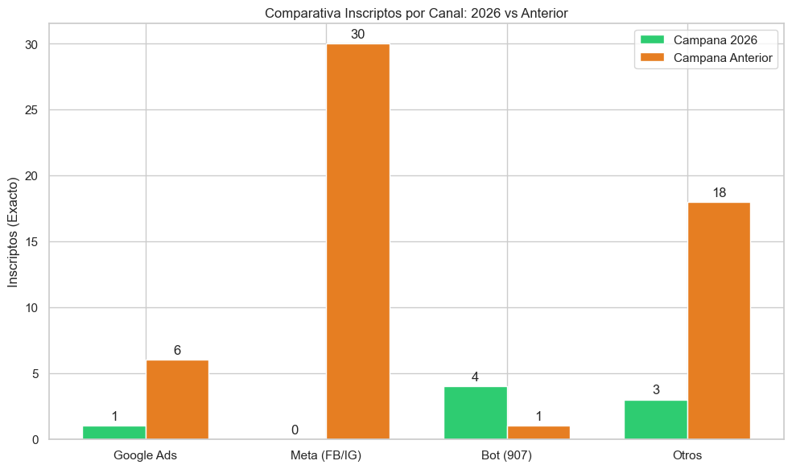

### Análisis de Tiempos de Resolución (Inscriptos Exactos)
Comparativa gráfica de cuánto demora en inscribirse un prospecto según su origen (filtrado de 0 a 180 días).

| Origen_Agrupado    |   Promedio |   Mediana |   Moda |
|:-------------------|-----------:|----------:|-------:|
| Orgánicos/Directos |       65   |      32.5 |      4 |
| Pagados (Meta/UTM) |       90.1 |      95   |    116 |

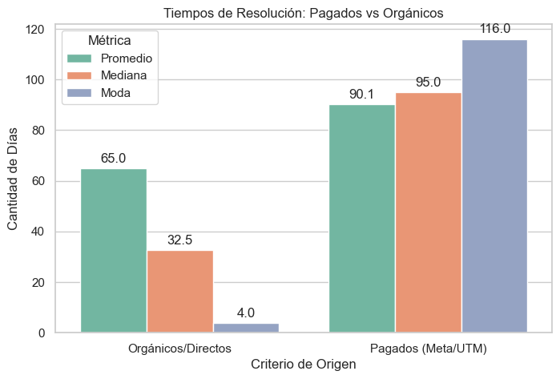
### Volumen de Consultas por Día y Mes
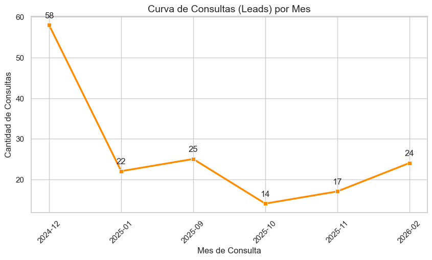

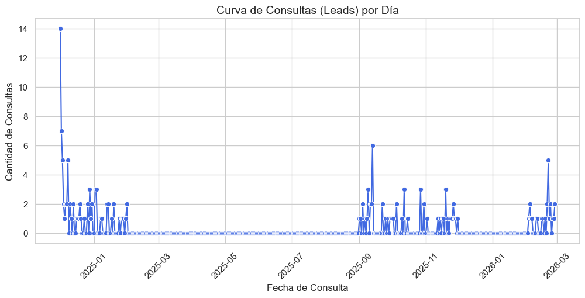

### Analisis Multi-Touch de Inscriptos
Cada inscripto puede haber consultado por multiples canales antes de inscribirse.

| Metrica | Total | 2026 | Campana Anterior |
|---|---|---|---|
| Inscriptos con 1 sola consulta | 68 (73.1%) | 24 (80.0%) | 44 (69.8%) |
| Promedio consultas por inscripto | 1.3 | 1.2 | 1.4 |
| Inscriptos con 1 canal | 88 (94.6%) | 29 (96.7%) | 59 (93.7%) |
| Inscriptos con 2+ canales | 5 (5.4%) | 1 (3.3%) | 4 (6.3%) |
| **Total inscriptos** | **93** | **30** | **63** |

#### Top Combinaciones (Total)
| Combinacion    |   Inscriptos |
|:---------------|-------------:|
| Meta           |           44 |
| Otros          |           34 |
| Google         |            7 |
| Bot            |            3 |
| Google + Otros |            2 |
| Meta + Otros   |            2 |
| Bot + Google   |            1 |

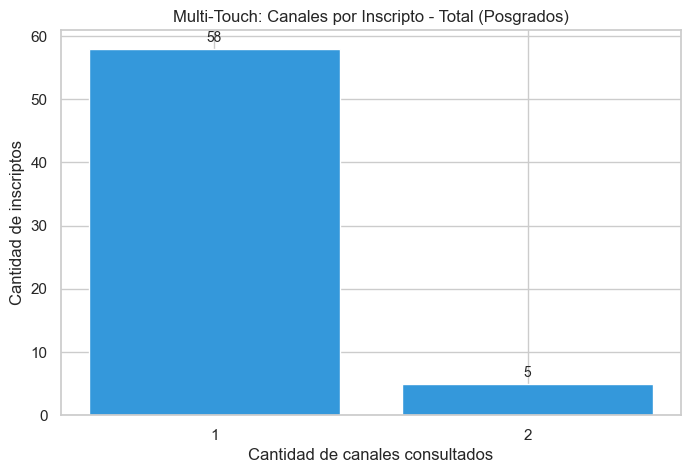
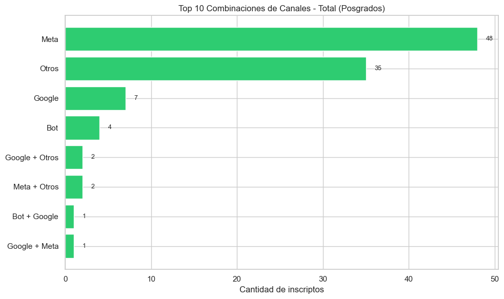
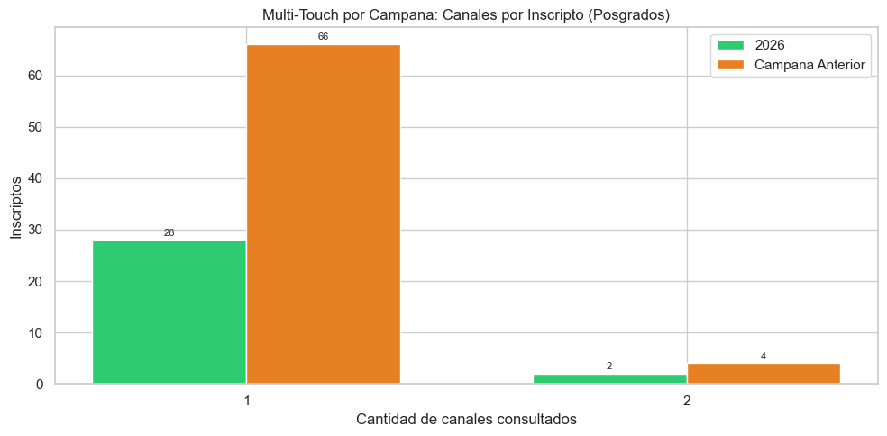

### Analisis Any-Touch: Participacion por Canal
Para cada inscripto se verifica si tuvo **al menos 1 contacto** con cada canal.
Un inscripto puede aparecer en varios canales a la vez (la suma supera 100%).

| Canal | Total | 2026 | Campana Anterior |
|---|---|---|---|
| **Bot** | 4 (4.3%) | 4 (13.3%) | 0 (0.0%) |
| **Google Ads** | 10 (10.8%) | 3 (10.0%) | 7 (11.1%) |
| **Meta (FB/IG)** | 46 (49.5%) | 7 (23.3%) | 39 (61.9%) |
| **Otros** | 38 (40.9%) | 17 (56.7%) | 21 (33.3%) |

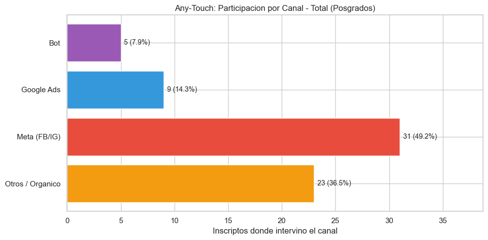
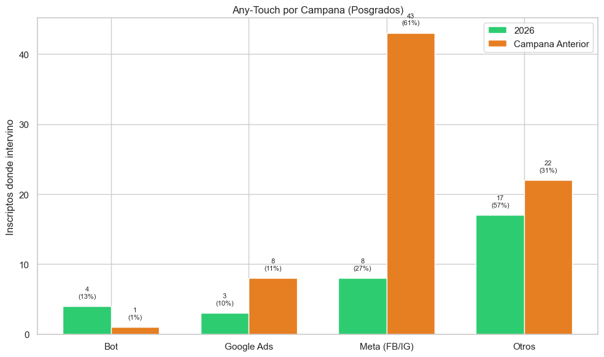

## 2. Journey del Estudiante (Comportamiento)
Analizando el número de veces que un usuario consulta antes de pagar su matrícula, observamos los siguientes patrones:

- **Promedio de Consultas por Persona:** 1.2 veces.
- **Tiempo de Decisión Promedio:** Un usuario tarda en promedio **67.9 días** desde su primera consulta hasta que formaliza el pago.

### Principales Fuentes que Inician el Recorrido (1er Touch) en Usuarios Inscriptos:
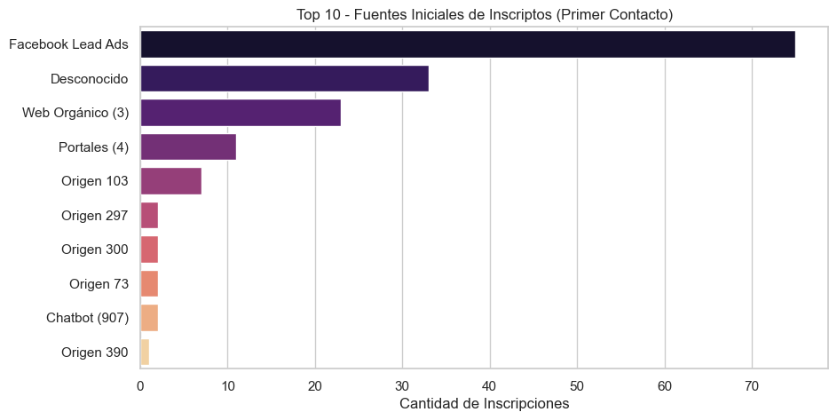
- **Facebook Lead Ads**: 21 inscriptos
- **Web Orgánico (3)**: 4 inscriptos
- **Portales (4)**: 4 inscriptos
- **Origen 103**: 3 inscriptos
- **Desconocido**: 1 inscriptos
- **Origen 6**: 1 inscriptos
- **Origen 625**: 1 inscriptos
- **Chatbot (907)**: 1 inscriptos

## 3. Curva de Inscripciones a lo largo del tiempo
La siguiente curva muestra el volumen de pagos confirmados por fecha, destacando los picos de inscripciones.

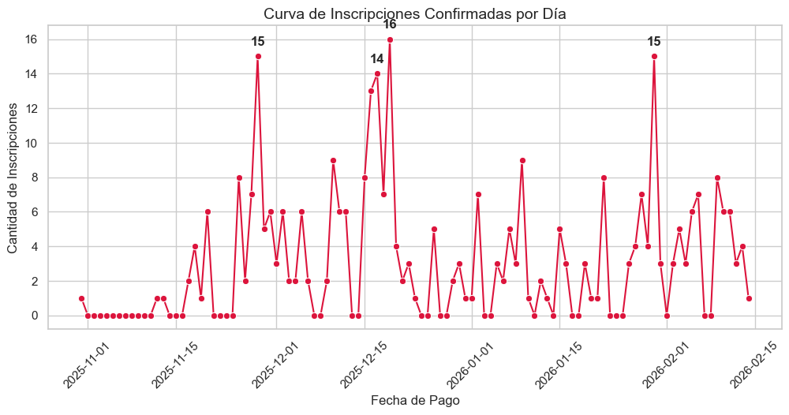

### Análisis de Picos de Inscripción
Los 4 días con mayor volumen de inscripciones confirmadas fueron:

| Fecha | Día de la Semana | Cantidad de Inscripciones |
|-------|------------------|---------------------------|
| 19/12/2025 | Viernes | 16 |
| 28/11/2025 | Viernes | 15 |
| 30/01/2026 | Viernes | 15 |
| 17/12/2025 | Miércoles | 14 |

### Análisis de Valles de Inscripción (Días de menor actividad)
Analizando los días con las caídas más fuertes de inscripciones, podemos observar el patrón de comportamiento (mostrando los 15 días más bajos):

| Fecha | Día de la Semana | Cantidad de Inscripciones |
|-------|------------------|---------------------------|
| 01/11/2025 | Sábado | 0 |
| 02/11/2025 | Domingo | 0 |
| 03/11/2025 | Lunes | 0 |
| 04/11/2025 | Martes | 0 |
| 05/11/2025 | Miércoles | 0 |
| 06/11/2025 | Jueves | 0 |
| 07/11/2025 | Viernes | 0 |
| 08/11/2025 | Sábado | 0 |
| 09/11/2025 | Domingo | 0 |
| 10/11/2025 | Lunes | 0 |
| 11/11/2025 | Martes | 0 |
| 14/11/2025 | Viernes | 0 |
| 15/11/2025 | Sábado | 0 |
| 16/11/2025 | Domingo | 0 |
| 21/11/2025 | Viernes | 0 |

**Observación sobre los valles:** El 40.0% de los días con menor volumen de inscripciones del histórico analizado coinciden directamente con fines de semana (Sábado/Domingo).

## Conclusiones y Recomendaciones

1. **Atribución de Marketing:** Se logró trazar el origen de un alto porcentaje de inscriptos, lo que demuestra que los esfuerzos de captación inicial en Salesforce tienen un impacto directo comprobable.
2. **Tiempo de Maduración:** Dado que el tiempo promedio de decisión supera el contacto inicial, las estrategias de "Remarketing" o "Nutrición de Leads" por email/teléfono durante estas semanas intermedias son vitales.
3. **Calidad de Datos:** Una porción de los registros se inscribió de manera directa o ingresó usando correos/teléfonos muy distintos. Se recomienda continuar fortaleciendo la trazabilidad mediante canales digitales.

